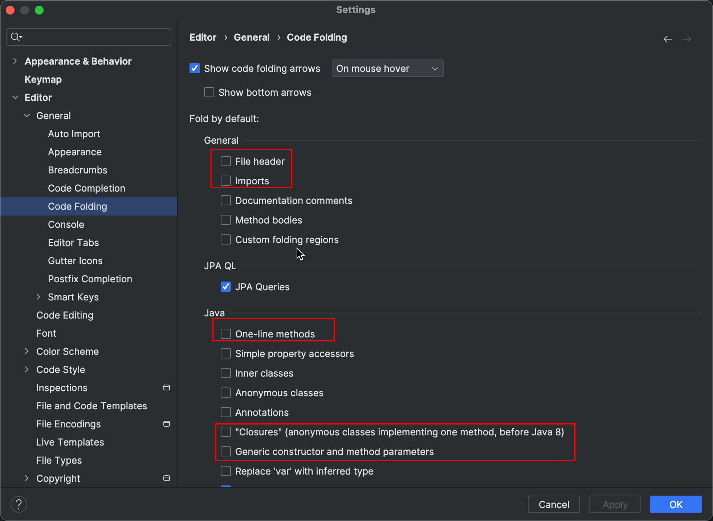

# Java related Tools

## IntelliJ IDEA 

### configuration for beginners

1. As shown above, click on the `Auto Import` option and check the `Add unambiguous imports on the fly` and `Optimize imports on the fly` options. This will automatically add imports and optimize imports in your code.

2. As shown above, click on the `Appearance` option and check the `Show line numbers` option. This will show line numbers in your code.

3. As shown above, click on the `Code Folding` option and turn off the `File header`, `Imports`, `One-line methods`, `Closure braces`, and `Generic constructor and method parameters` options.
By doing this, you can see more code on your screen.

## JShell
JShell is an interactive tool for learning Java programming language. It is a Read-Eval-Print Loop (REPL), which evaluates declarations, statements, and expressions as they are entered and immediately shows the results.

### Basic Commands
- `/help` : Displays the list of commands available in JShell.
- `/exit` : Exits the JShell tool.
- `/vars` : Displays the list of variables declared in JShell.
- `/methods` : Displays the list of methods declared in JShell.

